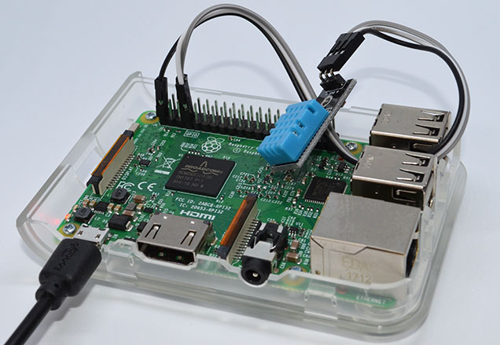
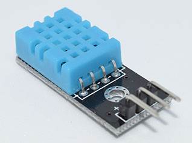

# EXAMPLE ONE 

### Note: Great description of how to set up wiring
### One of the clearest set of instructions available

#### Temperature Sensor for Windows 10 IoT Core
#### August 24, 2017jevpankov
#### https://jev-pankov.com/2017/08/24/temperature-sensor-for-windows-10-iot-core/
### NOTES
#### Certificate Issue 
###### See related information
###### 
##### CURRENT POINTS OF FAILURE [As of April 28, 2018]: 
1. UNABLE TO BUILD 
2. UNABLE TO DEBUG

