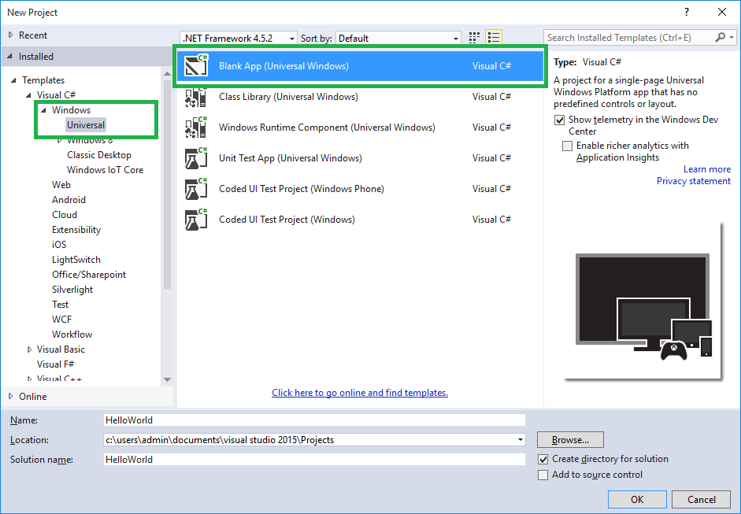

# CREATE A NEW C SHARP PROJECT

# IOT

### Windows Universal

### Note: This is NOT using the IoT template

#### The source of all the information on this page, including images, is from: https://github.com/Microsoft/Windows-iotcore-samples/tree/master/Samples/HelloWorld/CS | As accessed April 25, 2018

1. Start Visual Studio 2017.

2. Create a new project with (File | New Project...).

3. In the New Project dialog, navigate to Universal as shown below (in the left pane in the dialog: Templates | Visual C# | Windows | Universal).

4. Select the template Blank App (Windows Universal).

5. Remember to give a good name to your first app! In this example, we called the project 'HelloWorld'.

