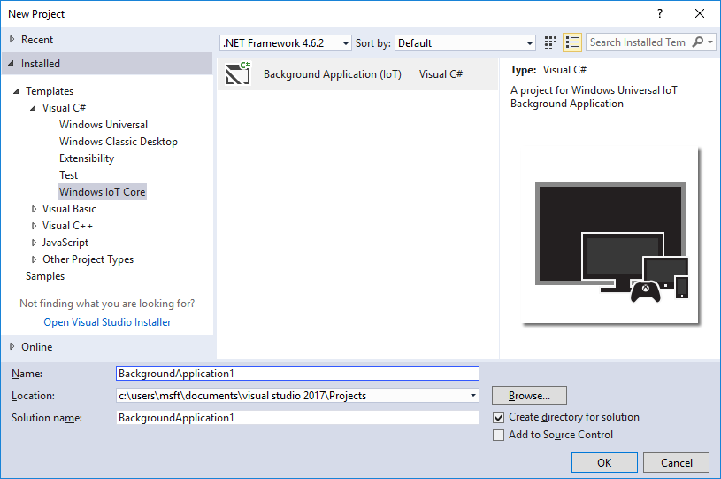

#### Windows IoT Core Project Templates for VS 2017
#### https://marketplace.visualstudio.com/items?itemName=MicrosoftIoT.WindowsIoTCoreProjectTemplatesforVS15

##### ONLY FOR USE WITH VISUAL STUDIO 2017
######
(for Visual Studio 2015: https://marketplace.visualstudio.com/items?itemName=MicrosoftIoT.WindowsIoTCoreProjectTemplates)

 

##### This package contains project templates for Windows IoT Core Applications

##### The Windows IoT Core Project Templates enables development for Windows IoT Core devices (such as Raspberry Pi 2 & 3, Minnowboard Max, and DragonBoard 410c) using Visual Studio 2017. 

##### For more information about Windows 10 IoT Core, visit www.windowsondevices.com.

##### For more information about building applications using these templates, visit https://developer.microsoft.com/en-us/windows/iot/docs/buildingappsforiotcore.

##### Universal Windows Platform (UWP) templates are provided to enable headless Background Applications for these supported languages:

